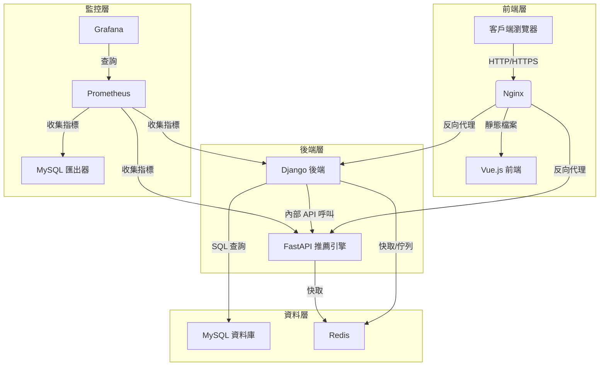

# Booking Platform 專案說明文件


## 專案概述
這是一個輕量的預約平台，旨在提供商家管理、預約服務與後台管理功能。本倉庫包含核心代碼片段，主要展示 Django REST Framework（主後端）、FastAPI（推薦引擎）與 Vue.js（前端）結合的技術實現。資料庫使用 MySQL，搭配 Redis 進行快取與訊息佇列處理。監控方面預設使用 Prometheus 與 Grafana。此專案僅提供關鍵代碼，需自行補充其他與資源才能完整運行。

設計上以簡潔實用為主，適合學習或作為快速原型開發的參考。

## 專案亮點
- **模組化架構**：採用 Django REST Framework 與 FastAPI 分離核心業務與推薦引擎，確保高可維護性與擴展性。
- **個人化推薦**：FastAPI 推薦引擎支援 A/B 測試與 Redis 快取，提供高效能的個人化商家推薦。
- **現代化前端**：Vue.js 搭配 Pinia 與 Bootstrap，提供流暢且響應式的使用者體驗。
- **全面監控**：整合 Prometheus 與 Grafana，提供系統效能與業務指標的即時監控。
- **安全認證**：使用 JWT 實現跨服務的統一認證，確保資料安全。
- **容器化部署**：支援 Docker 與 Docker Compose，簡化開發與生產環境部署。

## 系統架構
以下是系統架構圖，展示模組間關係：



### 架構說明
- **前端（Vue.js）**：負責使用者介面，包含商家列表、預約流程等，搭配 Pinia 管理狀態，透過 Axios 與後端 API 互動。
- **主後端（Django REST Framework）**：實現核心業務邏輯，如使用者認證（JWT）、商家管理、預約管理，連線 MySQL 儲存數據。
- **推薦引擎（FastAPI）**：提供個人化商家推薦，與 Django 共享 JWT 認證，透過 Redis 快取資料。
- **資料庫（MySQL）**：儲存結構化數據，如使用者、商家、預約等。
- **Redis**：用於快取與訊息佇列，支援高效能與 A/B 測試。
- **Nginx**：作為反向代理，處理前端靜態檔案與後端請求分發。
- **監控（Prometheus + Grafana）**：監控系統效能，提供基礎指標追蹤。

## 環境需求
- Docker & Docker Compose（建議版本 20.10 或以上）
- Node.js（前端開發，建議版本 18.x）
- Python 3.10（本地開發用）
- npm（前端套件管理）

## 安裝與部署

**注意**：本倉庫僅提供關鍵代碼，需自行補充環境變數檔案（`.env_backend`、`.env_fastapi`）及其他資源。以下為參考指引，實際部署需根據你的環境調整。

### 1. 複製專案
```bash
git clone https://github.com/BpsEason/booking-platform-django-fastapi.git
cd booking-platform-django-fastapi
```

### 2. 啟動服務
在專案根目錄執行：
```bash
docker-compose up --build
```

- **注意**：首次啟動需下載映像並編譯，可能較慢。確認以下埠未被佔用：
  - 80（Nginx）
  - 8000（Django）
  - 8001（FastAPI）
  - 3306（MySQL）
  - 6379（Redis）
  - 9090（Prometheus）
  - 3000（Grafana）

### 3. 安裝前端依賴
進入前端目錄並安裝：
```bash
cd frontend
npm install
```

開發模式：
```bash
npm run dev
```

部署前編譯：
```bash
npm run build
```

### 4. 初始化資料庫
執行 Django 資料庫遷移：
```bash
docker exec -it booking-platform-django-fastapi_django_backend python manage.py migrate
```

若需初始資料，可在 `mysql_init_scripts/` 放置 SQL 檔案並重新啟動 MySQL 容器。

### 5. 存取服務
- 前端：`http://localhost`
- Django Admin：`http://localhost/admin`（需自行設定帳號）
- FastAPI 文件：`http://localhost:8001/docs`
- Grafana：`http://localhost:3000`（預設帳號/密碼：admin/admin）

## 使用方式

### 使用者功能
- **註冊/登入**：透過 `/register` 或 `/login` 建立帳號，支援顧客與商家管理員角色。
- **瀏覽商家**：在 `/merchants` 查看商家列表，點擊查看詳情並預約。
- **預約服務**：選擇商家、服務、日期與時間完成預約。
- **個人檔案**：在 `/profile` 更新資料或更改密碼。
- **我的預約**：在 `/my-bookings` 管理預約記錄。

### 商家管理員功能
- **管理商家**：在 `/merchant-admin` 新增或編輯商家資訊。
- **管理服務**：為商家新增服務，設定價格與時長。
- **預約管理**：確認、取消或標記預約為已完成。

### 推薦引擎
- 透過 FastAPI 的 `/api/recommend/get-recommendations/` 取得推薦，支援 A/B 測試（調整 `.env_fastapi` 的 `AB_TEST_STRATEGY_VARIANTS`）。

## 面試常見問題 (Q&A)

### Q1: 這個專案的整體架構是什麼？為什麼選擇這樣的技術棧 (Django, FastAPI, Vue.js, Docker)？
**答**：  
這個專案採用**微服務導向的架構**。  
- **Django (Python)** 作為主要後端，負責核心業務邏輯（如使用者、商家、預約管理）、認證授權、管理後台等。選擇 Django 是因為它成熟穩定、開發效率高、生態系統豐富，且內建了完善的 ORM 和管理介面，非常適合處理複雜的業務邏輯和數據模型。  
- **FastAPI (Python)** 作為獨立的推薦引擎服務。選擇 FastAPI 是因為它基於 ASGI，天生支援異步，性能極高，並且內建 OpenAPI/Swagger UI 文檔生成，非常適合構建獨立的、高性能的 API 服務，特別是對於需要快速響應的推薦演算法。  
- **Vue.js** 作為前端框架，用於構建互動式、響應式的使用者介面。選擇 Vue.js 是因為它學習曲線平緩、易於整合、組件化開發效率高，能夠快速構建豐富的使用者體驗。  
- **Docker 與 Docker Compose** 用於整個專案的容器化。這使得開發環境與生產環境保持一致，簡化了部署流程，解決了依賴管理問題，並提升了專案的可攜性與隔離性。

### Q2: 為什麼在後端同時使用了 Django 和 FastAPI，而不是只用一個？它們各自的職責是什麼？
**答**：  
同時使用 Django 和 FastAPI 是基於**職責分離**和**性能優化**的考量：  
- **Django** 負責**交易性**和**業務複雜性較高**的部分。例如，使用者註冊登入、商家資料管理、預約排程等，這些操作通常涉及多個模型的複雜關聯、事務性操作以及管理員介面。Django 的 ORM 和 Admin 系統在這裡展現其優勢。  
- **FastAPI** 則專注於**計算密集型**或**高吞吐量**的特定任務，例如推薦服務。推薦演算法可能需要快速處理大量數據並即時響應，FastAPI 的異步能力和高性能使其成為理想選擇。透過將推薦邏輯抽離為獨立服務，我們可以獨立擴展它，不影響 Django 主服務的穩定性。

### Q3: 專案中如何處理資料庫初始化和遷移？為什麼採用現在的方式？
**答**：  
專案的資料庫初始化主要有兩種方式：  
1. **初始階段**：將完整的 SQL schema 腳本（如 `init_database_schema.sql`）放置在 `mysql_init_scripts/` 目錄中。Docker Compose 啟動 MySQL 服務時，會自動執行這些腳本來建立初始的資料庫結構。這樣可以確保資料庫在容器首次啟動時即具備完整的結構，特別適合從現有 SQL 設計開始的專案。  
2. **後續開發與維護**：資料庫結構的變更則完全依賴 **Django 的遷移系統** (`makemigrations` 和 `migrate`)。這是一種程式碼驅動的資料庫管理方式，將資料庫結構的變化轉換為一系列 Python 腳本。優點包括：  
   - **版本控制**：遷移腳本可被 Git 管理，方便追蹤資料庫歷史變化。  
   - **團隊協作**：團隊成員能自動應用或回滾資料庫變更。  
   - **數據庫獨立性**：雖然目前使用 MySQL，但 Django 遷移理論上支援更換其他資料庫系統。  
採用兩種方式結合是為了兼顧**首次快速啟動**與**長期維護的便利性**。

### Q4: 專案的監控 (Prometheus, Grafana) 是如何整合的？它提供了哪些關鍵指標？
**答**：  
專案整合了 **Prometheus** 和 **Grafana** 進行全面監控。  
- **Prometheus** 作為時序資料庫，負責收集各個服務的指標數據。我們會配置 Django 和 FastAPI 應用程式暴露監控端點（例如 `/metrics`），Prometheus 會定期從這些端點拉取數據。Nginx 的存取日誌也可以被處理成指標。  
- **Grafana** 是一個強大的數據可視化工具，連接到 Prometheus 作為資料源。我們可以在 Grafana 中創建儀表板，實時監控關鍵性能指標 (KPIs)。  
**關鍵指標包括**：  
- **應用程式健康狀況**：CPU 使用率、記憶體消耗、網路流量。  
- **請求吞吐量**：每秒請求數 (RPS)。  
- **響應時間**：API 響應延遲 (p95, p99)。  
- **錯誤率**：HTTP 5xx 錯誤、應用程式日誌中的錯誤數量。  
- **資料庫性能**：查詢時間、連接數、慢查詢。  
- **特定業務指標**：預約成功率、新用戶註冊數、推薦引擎的查詢次數等。  
這套監控系統有助於及早發現問題、優化性能、並支持容量規劃。

### Q5: 如果要將此專案部署到生產環境，您會考慮哪些額外的步驟或安全措施？
**答**：  
部署到生產環境時，會考慮以下額外步驟和安全措施：  
1. **環境變數安全**：將所有敏感信息（如資料庫密碼、API 金鑰、Django `SECRET_KEY`）從 `.env` 檔案移除，改用 Docker Secrets、Kubernetes Secrets、Vault 或專用的環境變數管理服務。  
2. **禁用 DEBUG 模式**：確保 Django 的 `DEBUG` 設置為 `False`，避免洩露敏感信息。  
3. **配置 `ALLOWED_HOSTS` 和 CORS**：精確配置 Django 的 `ALLOWED_HOSTS` 和 CORS 設置 (`CORS_ALLOWED_ORIGINS`，FastAPI 的 `allow_origins`)，只允許來自授權域名的請求，防止 CSRF 和跨域攻擊。  
4. **HTTPS**：部署 SSL 憑證，強制所有流量通過 HTTPS，加密客戶端與服務器之間的通訊。可以使用 Nginx 配置 Let's Encrypt 或其他 SSL 服務。  
5. **日誌集中化**：整合 ELK Stack (Elasticsearch, Logstash, Kibana) 或 Grafana Loki，將所有服務的日誌集中收集、分析和可視化，便於故障排除和安全審計。  
6. **備份策略**：建立定期的資料庫備份和恢復策略，確保數據安全。  
7. **資源限制**：在 Docker Compose 或 Kubernetes 中為每個服務設定 CPU 和記憶體限制，防止單個服務耗盡所有資源。  
8. **安全性更新**：定期更新所有依賴庫和基礎鏡像到最新版本，修補已知的安全漏洞。  
9. **防火牆與網路隔離**：配置伺服器防火牆，只開放必要的端口；將資料庫和內部服務放置在私有網路中，不直接暴露在公共網路。  
10. **壓力測試與性能優化**：在部署前進行壓力測試，識別性能瓶頸並進行優化，確保應用程式在高負載下的穩定性。

## 關鍵代碼片段（含註解）

### Django 設定 (`backend/core_project/settings.py`)
```python
# 定義專案根目錄
BASE_DIR = Path(__file__).resolve().parent.parent

# 從環境變數取得密鑰，確保安全性
SECRET_KEY = os.environ.get('DJANGO_SECRET_KEY', 'default-django-secret-key-for-dev')
DEBUG = os.environ.get('DJANGO_DEBUG', 'True') == 'True'

# 允許的域名，需在正式環境加入實際域名
ALLOWED_HOSTS = ['localhost', '127.0.0.1', '[::1]', os.environ.get('HOST_IP', '')]

# 安裝的應用程式，包含內建與自訂應用
INSTALLED_APPS = [
    'django.contrib.admin',
    'django.contrib.auth',
    'django.contrib.contenttypes',
    'django.contrib.sessions',
    'django.contrib.messages',
    'django.contrib.staticfiles',
    'rest_framework',
    'rest_framework_simplejwt',
    'corsheaders',
    'apps.users',
    'apps.merchants',
    'apps.appointments',
    'apps.common',
]

# 中間件設定，包含 CORS 與安全相關功能
MIDDLEWARE = [
    'corsheaders.middleware.CorsMiddleware',
    'django.middleware.security.SecurityMiddleware',
    'django.contrib.sessions.middleware.SessionMiddleware',
    'django.middleware.common.CommonMiddleware',
    'django.middleware.csrf.CsrfViewMiddleware',
    'django.contrib.auth.middleware.AuthenticationMiddleware',
    'django.contrib.messages.middleware.MessageMiddleware',
    'django.middleware.clickjacking.XFrameOptionsMiddleware',
]

# 資料庫設定，使用 MySQL
DATABASES = {
    'default': {
        'ENGINE': 'django.db.backends.mysql',
        'NAME': os.environ.get('DATABASE_NAME'),
        'USER': os.environ.get('DATABASE_USER'),
        'PASSWORD': os.environ.get('DATABASE_PASSWORD'),
        'HOST': os.environ.get('DATABASE_HOST'),
        'PORT': os.environ.get('DATABASE_PORT'),
        'OPTIONS': {
            'init_command': "SET sql_mode='STRICT_TRANS_TABLES'"
        }
    }
}

# JWT 認證設定
REST_FRAMEWORK = {
    'DEFAULT_AUTHENTICATION_CLASSES': (
        'rest_framework_simplejwt.authentication.JWTAuthentication',
    ),
    'DEFAULT_PERMISSION_CLASSES': [
        'rest_framework.permissions.IsAuthenticated',
    ],
    'DEFAULT_PAGINATION_CLASS': 'rest_framework.pagination.PageNumberPagination',
    'PAGE_SIZE': 10
}

# CORS 設定，允許前端跨域請求
CORS_ALLOWED_ORIGINS = [
    os.environ.get('FRONTEND_URL', 'http://localhost:5173'),
]
CORS_ALLOW_CREDENTIALS = True
```

### FastAPI 推薦引擎 (`recommendation_engine/main.py`)
```python
from fastapi import FastAPI, Depends, HTTPException, status
from fastapi.security import OAuth2PasswordBearer
from pydantic import BaseModel
import redis
import json
import os
from jose import JWTError, jwt
from datetime import datetime
from typing import Optional, List, Dict
import random
import requests

# 環境變數設定
REDIS_HOST = os.environ.get("REDIS_HOST", "localhost")
REDIS_PORT = int(os.environ.get("REDIS_PORT", 6379))
REDIS_PASSWORD = os.environ.get("REDIS_PASSWORD", None)
JWT_SIGNING_KEY = os.environ.get("JWT_SIGNING_KEY", "your-secret-key")
DJANGO_BACKEND_URL = os.environ.get("DJANGO_BACKEND_URL", "http://localhost:8000")
AB_TEST_STRATEGY_VARIANTS = json.loads(os.environ.get("AB_TEST_STRATEGY_VARIANTS", '{}'))

# 初始化 FastAPI 應用
app = FastAPI(
    title="Recommendation Engine API",
    description="FastAPI service for generating merchant recommendations.",
    version="1.0.0"
)

# 初始化 Redis 連線
try:
    r = redis.Redis(host=REDIS_HOST, port=REDIS_PORT, password=REDIS_PASSWORD, decode_responses=True)
    r.ping()
    print("Connected to Redis successfully!")
except redis.exceptions.ConnectionError as e:
    print(f"Could not connect to Redis: {e}")
    r = None

# JWT 認證設定，與 Django 共享同一簽署密鑰
oauth2_scheme = OAuth2PasswordBearer(tokenUrl="/api/token")

# Pydantic 模型定義
class TokenData(BaseModel):
    user_id: Optional[int] = None
    username: Optional[str] = None
    email: Optional[str] = None
    user_type: Optional[str] = None

# 驗證 JWT Token 並取得使用者資料
async def get_current_user(token: str = Depends(oauth2_scheme)) -> TokenData:
    credentials_exception = HTTPException(
        status_code=status.HTTP_401_UNAUTHORIZED,
        detail="Could not validate credentials",
        headers={"WWW-Authenticate": "Bearer"},
    )
    try:
        payload = jwt.decode(token, JWT_SIGNING_KEY, algorithms=["HS256"])
        user_id: int = payload.get("user_id")
        username: str = payload.get("username")
        email: str = payload.get("email")
        user_type: str = payload.get("user_type")
        if user_id is None:
            raise credentials_exception
        token_data = TokenData(user_id=user_id, username=username, email=email, user_type=user_type)
    except JWTError:
        raise credentials_exception
    return token_data

# 簡單的 A/B 測試邏輯，根據 user_id 分配測試組
def get_ab_test_variant(user_id: int) -> str:
    if not AB_TEST_STRATEGY_VARIANTS:
        return "default"
    variants = list(AB_TEST_STRATEGY_VARIANTS.keys())
    weights = list(AB_TEST_STRATEGY_VARIANTS.values())
    random.seed(user_id)
    return random.choices(variants, weights=weights, k=1)[0]

# 推薦端點，根據使用者取得商家推薦
@app.get("/get-recommendations/", response_model=List[Dict])
async def get_recommendations(current_user: TokenData = Depends(get_current_user)):
    user_id = current_user.user_id
    user_type = current_user.user_type
    
    if user_type == 'merchant_admin':
        return JSONResponse(content=[], status_code=status.HTTP_200_OK)

    ab_variant = get_ab_test_variant(user_id)
    print(f"User {user_id} is in A/B test variant: {ab_variant}")

    # 模擬推薦邏輯，從 Redis 取得快取資料或生成預設資料
    recommended_merchants_data = []
    if r:
        dummy_merchants_json = r.get("dummy_recommended_merchants")
        if dummy_merchants_json:
            recommended_merchants_data = json.loads(dummy_merchants_json)
        else:
            recommended_merchants_data = [
                {"id": 1, "name": "Cozy Coffee Shop", "address": "123 Main St", "description": "Great coffee and ambiance.", "image": "http://example.com/coffee.jpg"},
                {"id": 2, "name": "Zen Spa", "address": "456 Oak Ave", "description": "Relaxing massage and wellness services.", "image": "http://example.com/spa.jpg"},
                {"id": 3, "name": "Quick Bites Diner", "address": "789 Pine Ln", "description": "Classic American comfort food.", "image": "http://example.com/diner.jpg"}
            ]
            r.set("dummy_recommended_merchants", json.dumps(recommended_merchants_data), ex=3600)
    else:
        recommended_merchants_data = [
            {"id": 1, "name": "Cozy Coffee Shop", "address": "123 Main St", "description": "Great coffee and ambiance.", "image": "http://example.com/coffee.jpg"},
            {"id": 2, "name": "Zen Spa", "address": "456 Oak Ave", "description": "Relaxing massage and wellness services.", "image": "http://example.com/spa.jpg"},
            {"id": 3, "name": "Quick Bites Diner", "address": "789 Pine Ln", "description": "Classic American comfort food.", "image": "http://example.com/diner.jpg"}
        ]

    # 記錄推薦事件，發送至 Django 後端
    log_recommendation_event(user_id, recommended_merchants_data, ab_variant)
    return recommended_merchants_data
```

### Vue.js 前端 - 首頁 (`frontend/src/views/HomeView.vue`)
```vue
<script setup>
import { ref, onMounted } from 'vue';
import { useRouter } from 'vue-router';
import { useAuthStore } from '@/stores/auth';
import RecommendationService from '@/services/recommendation.service';

const authStore = useAuthStore();
const router = useRouter();
const recommendedMerchants = ref([]);
const isLoadingRecommendations = ref(false);

const fetchRecommendations = async () => {
  if (!authStore.isAuthenticated) return; // 未登入不顯示推薦
  isLoadingRecommendations.value = true;
  try {
    recommendedMerchants.value = await RecommendationService.getRecommendations();
  } catch (err) {
    console.error("Error fetching recommendations:", err);
  } finally {
    isLoadingRecommendations.value = false;
  }
};

const viewMerchantDetail = (merchantId) => {
  router.push({ name: 'merchant-detail', params: { id: merchantId } });
};

onMounted(fetchRecommendations);
</script>

<template>
  <div class="home-view">
    <!-- 顯示歡迎訊息與平台簡介 -->
    <div class="jumbotron text-center">
      <h1 class="display-4">歡迎使用預約平台</h1>
      <p class="lead">輕鬆預約您喜愛的服務，探索優質商家！</p>
      <router-link v-if="!authStore.isAuthenticated" to="/register" class="btn btn-primary btn-lg">立即註冊</router-link>
    </div>

    <!-- 顯示推薦商家 -->
    <h2 class="mt-5 mb-4 text-center">為您推薦的商家</h2>
    <div v-if="isLoadingRecommendations" class="text-center my-5">
      <div class="spinner-border text-primary" role="status">
        <span class="visually-hidden">載入中...</span>
      </div>
    </div>
    <div v-else-if="recommendedMerchants.length > 0" class="row row-cols-1 row-cols-md-2 row-cols-lg-3 g-4">
      <div class="col" v-for="merchant in recommendedMerchants" :key="merchant.id">
        <div class="card h-100 shadow-sm">
          <div class="card-body d-flex flex-column">
            <h5 class="card-title">{{ merchant.name }}</h5>
            <p class="card-text text-muted">{{ merchant.address }}</p>
            <p class="card-text">{{ merchant.description?.substring(0, 100) }}...</p>
            <button @click="viewMerchantDetail(merchant.id)" class="btn btn-outline-primary mt-auto">查看詳情</button>
          </div>
        </div>
      </div>
    </div>
    <div v-else class="alert alert-info text-center">
      目前無推薦商家，立即探索所有商家！
    </div>
  </div>
</template>

<style scoped>
.jumbotron {
  background-color: #f8f9fa;
  padding: 3rem;
}
</style>
```

## 注意事項
1. **安全性**：
   - 正式環境需更新 `.env_backend` 與 `.env_fastapi` 的密碼與密鑰。
   - MySQL 與 Grafana 預設密碼（`root_password`、`admin/admin`）需立即更改。
   - 設定 `DJANGO_DEBUG=False` 避免暴露敏感資訊。

2. **監控設定**：
   - Prometheus 與 Grafana 需自行配置 `prometheus.yml` 與儀表板。
   - 建議在 Django 與 FastAPI 啟用 `django-prometheus` 與 `prometheus-fastapi-instrumentator`。

3. **前端部署**：
   - 部署前執行 `npm run build`，確保 Nginx 指向 `frontend/dist`。
   - 確認 `CORS_ALLOWED_ORIGINS` 包含正確前端域名。

4. **資料庫初始化**：
   - 自訂模型需在 `backend/apps/*/models.py` 定義並執行遷移。
   - 可在 `mysql_init_scripts/` 加入初始資料。

5. **推薦引擎**：
   - 目前為模擬邏輯，實際應用需整合機器學習或資料庫查詢。
   - A/B 測試配置可透過 `.env_fastapi` 的 `AB_TEST_STRATEGY_VARIANTS` 調整。

## 下一步
- 補充 Django 應用中的模型與 API（`apps/users`、`apps/merchants`、`apps/appointments`）。
- 為 FastAPI 整合真實推薦演算法。
- 配置 Grafana 儀表板，新增監控指標。
- 測試跨瀏覽器相容性，確保前端正常運作。

如需進一步協助，請提供更多專案細節，祝開發順利！
